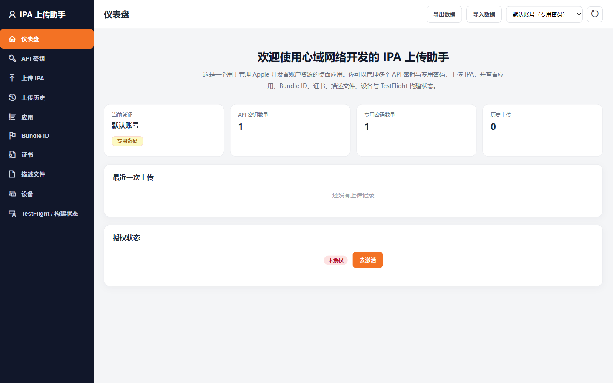

# IPA 上传助手

Windows 上的 App Store Connect IPA 上传与开发者资源管理工具。

- 图形化上传 IPA，无需命令行
- 支持 App Store Connect API Key 与 Apple ID 专用密码
- 自动识别应用、版本、构建号和上传团队
- 管理 Bundle ID、证书、描述文件、设备和 TestFlight 构建
- Apple 凭证只保存在本机，并通过 Windows DPAPI 加密

## 下载

请前往 [产品官网](https://iyqy.cn/products/windows-ios)) 下载最新版。

本仓库仅用于发布安装包、使用文档、截图和更新记录，不包含商业源码。
